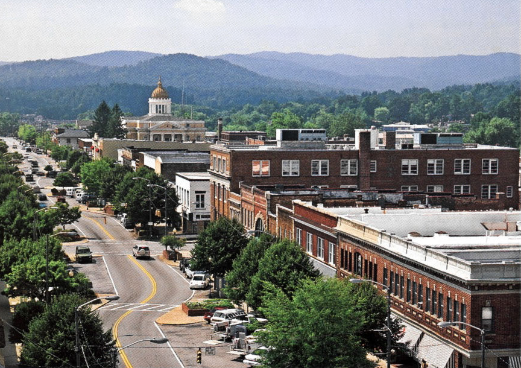

# Main Street Data Hub

This is a repository where code and data related to my research on the Main Street Program will be housed.

  

### Objective
The objective of this study (a 3-essay dissertation) is to identify the effectiveness of the Main Street Program as a small-scale economic development strategy in small towns and rural communities.

### About the Researcher

I am a Ph.D. candidate at The Ohio State University’s [John Glenn College of Public Affairs](https://glenn.osu.edu/). I am currently working on my dissertation, which uses the case of the Main Street Program to explore several questions surrounding local economic development policy. I currently work with [Dr. Ned Hill](http://glenn.osu.edu/faculty/glenn-faculty/hill/) on research related to regional economic resilience and have also worked with the [Ohio Manufacturing Institute](https://omi.osu.edu/) as a data analyst. I earned a B.S. in geography with a planning concentration and an M.A. in urban studies.

***

*See more at my personal [website](https://andrewvanleuven.com/).*
